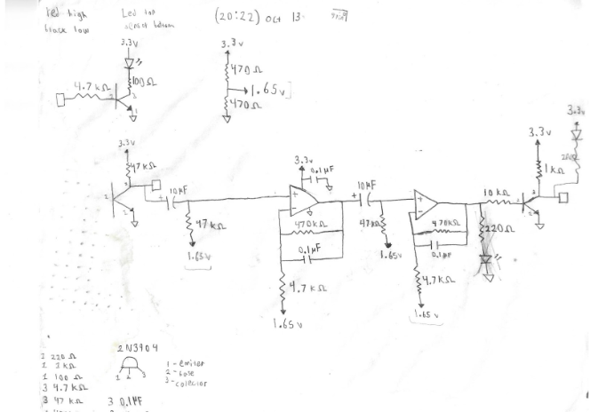
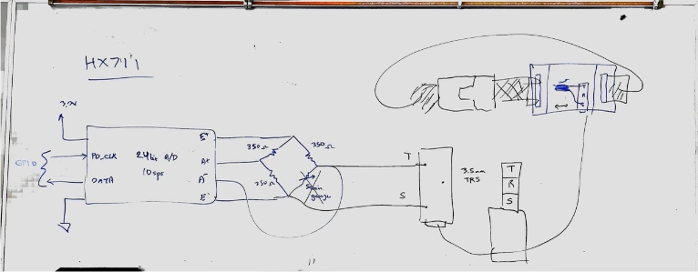
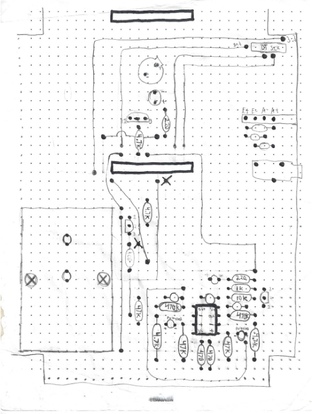

# Heart Rate & Respiratory Monitor

The hardware constructed for this project is **not** a medical device. It serves as an educational circuit to demonstrate practical signal processing techniques. The primary goal was to build a device capable of measuring a user’s pulse and respiration rate using optical reflection for pulse detection and a strain gauge for measuring breathing cycles.

## Project Overview
The project had five main requirements, all of which were successfully achieved:

1. **Heart Rate Monitor**: The device outputs nine consecutive valid measurements. While pulse detection generally works well, there may be occasional delays in reading.
   
2. **Finger Detection**: The device responds accurately, activating a red LED in under two seconds.

3. **Respiration Monitor**: Despite my strain gauge breaking close to the deadline, I borrowed a classmates strain gauge for testing, simulating breathing cycles by stretching the band back and forth.

4. **Shell Implementation**: A command shell was created, accounting for all required commands, including handling invalid inputs.

5. **Speaker Functionality**: The speaker reliably plays sounds and can be turned off. I started with the speaker disabled, enabling it via the shell when necessary.

## License and Usage

This project was developed as a school assignment, and while the code is provided free to use for learning and reference, it is strictly prohibited to use this code or its derivatives for any academic submission or coursework. Doing so would be considered academic dishonesty and a violation of school policies.

Please feel free to use this project to better understand the concepts used, but respect academic integrity by ensuring it is not submitted for grades.

## Design
The main schematic for pulse measurement is shown below:

## Description and Diagrams
The schematic responsible for measuring respiration rate is illustrated below:

The schematic for connecting the speaker to a PWM output, implemented in the final part of the project, is shown here:

Below is the layouts of the PC board:

